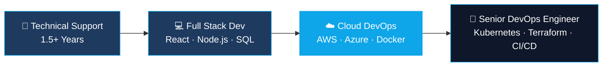

<div align="center">

<!-- Animated Header Banner -->


<!-- Typing Animation -->
<a href="https://git.io/typing-svg">
  
</a>

<br/>

<!-- Social Badges -->
[](https://linkedin.com/in/nimesh-de-alwis)
[](mailto:tharindualwis2003@gmail.com)
[](#)
[](https://github.com/nimesh-de-alwis)

</div>

---

## 🧑‍💻 About Me

```yaml
name: W.T Nimesh De Alwis
location: Sri Lanka 🇱🇰
role: Technical Support Executive → Software Engineer
company: mypos Software Solutions
experience: 1.5+ years

currently:
  - 🔨 Building full-stack apps with React & Node.js
  - ☁️  Transitioning into Cloud DevOps Engineering
  - 📚 Learning AWS, Azure, Docker & Kubernetes
  - 🎯 Targeting: Cloud DevOps Engineer role

philosophy: "Bridging the gap between technical support
             and software development to build better,
             more reliable systems."
```

---

## 🛠️ Tech Stack & Tools

<div align="center">

### 💻 Core Development


### 🎨 Frontend & Styling


### ☁️ Cloud & DevOps (Learning)


### 🔧 Tools & Platforms


</div>

---

## 📊 GitHub Stats

<div align="center">
  
  
</div>

<div align="center">
  
</div>

---

## 💼 Professional Experience

<table>
<tr>
<td width="60%">

### 🏢 Technical Support Executive
**mypos Software Solutions** · *1 Year 6 Months*

- 🔧 Provide technical support for **POS, ERP, Accounting & Payroll** solutions
- 🤝 Act as liaison between clients and company
- 📊 Handle project management & requirement analysis
- 🛠️ Install, configure & monitor software at client locations
- 🎓 Conduct client training sessions
- ✅ Own projects from inception to sign-off

</td>
<td width="40%">

### 🧰 Technical Expertise
```
✔ SQL Server & Windows Server
✔ POS/ERP System Management
✔ Crystal Reports
✔ Client Training & Documentation
✔ Troubleshooting & System Monitoring
✔ Cloud Computing Fundamentals
```

</td>
</tr>
</table>

---

## 🎯 Career Roadmap



### 📚 Current Learning Path
| Area | Status | Goal |
|------|--------|------|
| ☁️ AWS | 🟡 Learning | Solutions Architect Associate |
| 🔷 Azure | 🟡 Learning | AZ-900 → AZ-104 |
| 🐳 Docker | 🟡 Learning | Containerization Mastery |
| ☸️ Kubernetes | 🔴 Upcoming | Container Orchestration |
| 🏗️ Terraform | 🔴 Upcoming | Infrastructure as Code |
| 🔄 CI/CD | 🟡 Learning | GitHub Actions · Jenkins |

---

## 🏆 Certifications

<div align="center">

| 🎖️ Certification | Provider |
|-----------------|----------|
| .NET Development for Beginners | Microsoft / Online |
| Advanced Playwright Techniques | Testing Academy |
| C# and .NET Development with VS Code | Microsoft / Online |

</div>

---

## 📈 Skill Progress

```
Frontend Development    ████████████████████░░░░  85%
Backend Development     ████████████████████░░░░  80%
Cloud Technologies      █████████████████░░░░░░░  70%
DevOps Practices        ███████████████░░░░░░░░░  60%
```

---

## 📫 Contact Me

<div align="center">

| 📱 Phone | 📧 Email |
|---------|---------|
| 0701675084 / 0768476349 | tharindualwis2003@gmail.com |

<br/>

**💬 Open to:** Full-stack projects · Cloud DevOps roles · Collaboration · Mentorship

</div>

---

<div align="center">


*⭐ If you find my work interesting, consider giving my repos a star!*

</div>
