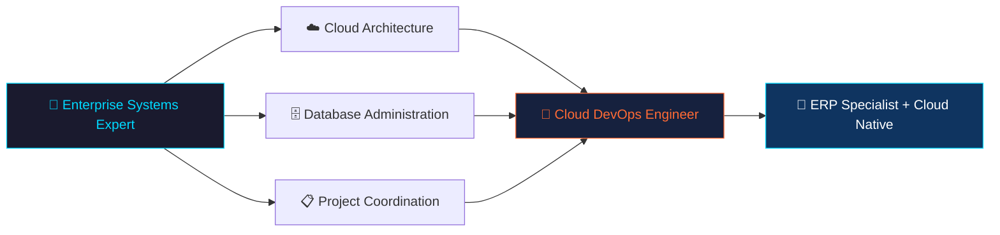

<div align="center">

<!-- Animated Header -->


<!-- Typing Animation -->
[](https://git.io/typing-svg)

<br/>

<!-- Profile Views & Social Badges -->

[](mailto:tharindualwis2003@gmail.com)
[](www.linkedin.com/in/tharindu-nimesh-de-alwis)

</div>

---

## 🧠 About Me

```yaml
name: W.T. Nimesh De Alwis
location: Sri Lanka 🇱🇰

current_focus:
  - Cloud DevOps Engineering ☁️
  - Database Administration 🗄️
  - Full Stack Development 💻
  - ERP & POS Systems Specialist 🏢
  - Project Coordination 📋

certifications_in_progress:
  - AWS Cloud Practitioner
  - Azure Fundamentals
  - Kubernetes & Terraform

philosophy: "Bridging enterprise systems knowledge with modern cloud architecture"
```

---

## 🚀 Tech Stack & Tools

<div align="center">

### 💻 Languages & Frameworks


### 🗄️ Databases & Administration


### ☁️ Cloud & DevOps


### 🏢 Enterprise & ERP


</div>

---

## 📊 GitHub Stats

<div align="center">


</div>

<div align="center">

[](https://git.io/streak-stats)

</div>

---

## 🏆 Certifications

<div align="center">

| 🎓 Certification | 🏢 Issuer | 📅 Issued |
|---|---|---|
| React Essential Training | LinkedIn Learning | Feb 2026 |
| Learning GitHub | LinkedIn Learning | Feb 2026 |
| Power BI: Dashboards for Beginners | LinkedIn Learning | Feb 2026 |
| Introduction to Linux | LinkedIn Learning | Feb 2026 |
| Advanced Playwright Techniques | LinkedIn Learning | Oct 2025 |
| C# and .NET Development with VS Code | LinkedIn Learning | Oct 2025 |
| .NET Development for Beginners | LinkedIn Learning | Oct 2025 |

</div>

---

## 🎯 Goals & Learning Roadmap



- [x] ✅ React & Frontend Development
- [x] ✅ Node.js & Backend Development
- [x] ✅ SQL Server & Database Management
- [x] ✅ Linux Fundamentals
- [x] ✅ C# & .NET Development
- [ ] 🔄 AWS Cloud Practitioner Certification
- [ ] 🔄 Azure Fundamentals (AZ-900)
- [ ] 🔄 Docker & Kubernetes
- [ ] 🔄 Terraform (Infrastructure as Code)
- [ ] 🔄 CI/CD Pipelines (GitHub Actions)

---

## 💡 Domain Expertise

<div align="center">

| Domain | Skills |
|---|---|
| 🗄️ **Database Administration** | SQL Server, PostgreSQL, Crystal Reports, Query Optimization |
| 🏢 **ERP Specialist** | ERP Systems, POS Systems, Accounting & Payroll Solutions |
| 📋 **Project Coordination** | Requirements Analysis, Documentation, Client Training |
| ☁️ **Cloud Computing** | AWS, Azure, System Architecture, Monitoring |
| 🔧 **Technical Support** | Troubleshooting, Windows Server, System Configuration |

</div>

---

## 🤝 Let's Connect

<div align="center">

[](https://linkedin.com)
[](mailto:tharindualwis2003@gmail.com)
[](tel:+94701675084)

<br/>

> *"Bridging enterprise systems knowledge with modern cloud architecture to build scalable, reliable solutions."*

</div>

<!-- Footer Wave -->

